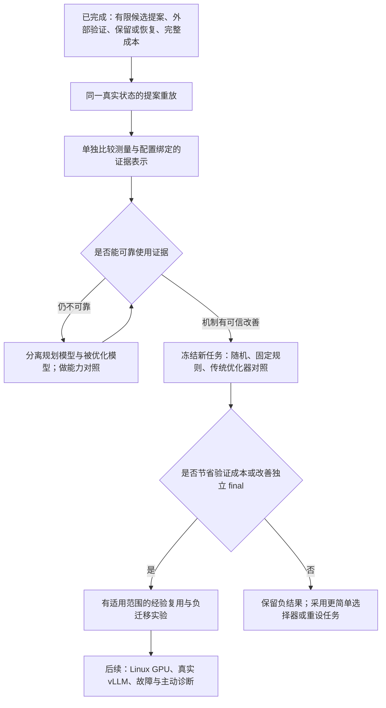

# 下一步研究方向与执行计划：2026-09-30

本轮是代码、既有证据和相关论文的探索，不启动新性能实验，也不修改历史结果。核对时本地与 GitHub 主分支为 `24e78eb8e958c867975bdccaedc1ac5e1a928a7c`；本文提出的功能均为计划，不能当作已实现。

## 1. 推荐的主线

继续导师提出的 **RSI / AI Infra / 大模型推理系统** 主线。近期问题收窄为：**固定模型权重与外部验收器时，Agent 能否正确利用带有配置归属的实测证据，在有限预算内更快得到可独立复测的推理配置改进？**

这比直接扩展 Memory 或 Meta-Improver 更容易验证。当前的具体障碍不是服务无法启动，而是合法提案仍可能误用证据：最新实验中，模型把当前 C05 的实测吞吐说成未测 C08 的“更高吞吐”。格式约束、候选排除和成本账本已解决部分工程问题；反馈是否改善后续决策仍未证明。

若该机制成立，再研究 **带适用范围的成功 / 失败经验如何降低新负载的验证成本、避免负迁移**。这保留 Scope-aware Memory 的长期方向，但其新颖性仍需进一步检索，不能仅凭“Agent + 记忆 + 推理调优”宣布贡献。

以上是人工制定的研究路线，不是 Agent 已自主改进策略，更不是已达到 L4 / L5。

## 2. 当前已经做了什么

| 部分 | 已验证事实 | 仍未成立的结论 |
| --- | --- | --- |
| 本地真实推理 | Windows、RTX 3070 Ti Laptop 8GB、llama.cpp b11138 Vulkan、固定 Qwen2.5-1.5B Q4_K_M | Linux / vLLM 运行和跨硬件效果尚未实测 |
| 有限 L2 闭环 | 模型提出配置，控制器压测、验收、重启复核、保留或恢复；初期一轮约 +29.9%，继承后复测和拒绝退化候选均成功 | 单次成功不等于普遍优于随机，也不等于模型权重变强 |
| 候选选择 | v3 / v3.1 提供稳定 16 项 ID，排除当前与执行过的候选，最多一次纠错；无随机兜底 | 合法 ID 不等于有依据的选择；排除由控制器完成 |
| 完整成本 | 成功与失败的逐调用时间、用量、解析、纠错；未知用量不记成零；只读 JSON / CSV 汇总 | token 不等于货币或电费；最近批次尚无逐项 final 耗时 |
| 输出约束 | v3 首轮 8 次调用全部因长输出未闭合；v3.1 限制解释长度并记录结束原因，后续真实调用有完整输出 | 不能由少量开发调用估计普遍成功率或语义正确率 |
| 比较与审计 | 环境 / 负载 / 历史消融、随机种子、固定规则、独立 final；最近两批共 9 项只读完整性审计通过；57 项测试通过 | 审计通过不证明策略优越性，也不代替质量评测 |
| 发布 | 基线、版本、测试、脚本、研究文档已提交到公开仓库 | 原始 runs、模型、vendor 和密钥未公开；文档中的 runs 链接仅在本地有效 |

16 项空间是 `parallel ∈ {1,2,4,8}` 与 `ubatch_size ∈ {64,128,256,512}`。初始 C05=(2,128)，固定规则 C11=(4,512)。人固定动作、目标、5% 门槛、延迟和完成条件，参考 / 候选交替测量各三次；该门槛是工程规则，不是统计显著性检验。

最近结果应按各自协议阅读，不能把不同槽位预算混成一个排行榜：

| 开发协议 | 方法 | 独立 final 收益 |
| --- | --- | ---: |
| 同一 prefill 任务、每方法一槽位 | full / no_feedback | 0% / 0% |
| 同上 | no_context | +6.42% |
| 同上 | 随机 seed 100 / 101 / 102 | 0% / +15.99% / 0% |
| 同上 | 固定规则 | +28.28% |
| 同一 prefill 任务、每方法两槽位 | full / no_history | 0% / +6.98% |

单槽位批次七项全部完成；分两段执行，累计 1105.235 秒，存在时间段差异。两槽位批次耗时 560.5 秒、4 次合法调用、3776 token、4 项候选执行、1 项接受、3 次恢复。

两槽位 full 与 no_history 首次选择及独立 baseline 数值不同，后续状态也不同，所以 **不能把 +6.98% 归因于隐藏历史，更不能说历史必然有害**。一槽位的 no_feedback 没有既往历史，也不能验证从失败中学习。保留 baseline 的 0% 按同配置规则定义，并非两个不同配置的收益估计。

当前只有功能冒烟测试，没有全面语义质量基准。没有实现 Scope-aware Memory、主动 Probe 或 Meta-Improver；保存并继承已验收配置不等于改进诊断策略。OpenRouter Key 仍不可用，已有本地实验不依赖它或训练。

详细原始入口见 [信息消融结果](CONTEXT_RESULTS_2026-09-30.md)、[历史反馈结果](HISTORY_RESULTS_2026-09-30.md)、[初始 L2 实测](RESULTS_2026-09-24.md) 与 [工作日志](WORKLOG_2026-09-30.md)。原始证据仅保存在本地，本文不暗示已上传。

## 3. 文献探索与这周先读的五篇

本轮查阅论文原始页面、摘要与部分方法段落；不是系统综述、全文精读或复现。2026 年条目标为预印本，不推断其同行评审状态。以下判断将作者报告与对本项目的推论分开。

| 顺序 | 论文 | 已核实的方法 / 结果 | 对本项目的用途 |
| --- | --- | --- | --- |
| 1 | [InferenceBench（2026 预印本）](https://arxiv.org/abs/2607.20468) | 在 H100 和时间预算下评估部署与推理优化；其报告中 Agent 仍不及同预算参数搜索 | 最接近当前课题；重点读场景、质量 / 完整性门槛、预算和强基线，不能把超过默认配置当研究终点 |
| 2 | [LLAMBO，ICLR 2024](https://arxiv.org/abs/2402.03921) | 不微调 LLM，以上下文实现 BO 的初始化、代理建模与候选采样 | 区分模型提供先验、模型预测和实际选点；“LLM + BO”本身已有先例 |
| 3 | [GPTuner，PVLDB 2024](https://www.vldb.org/pvldb/vol17/p1939-tang.pdf) | 从手册提炼结构化知识，做负载相关参数选择、范围优化与粗到细 BO | 借鉴“知识给先验、运行测量更新”的分工；数据库场景不能直接代替推理系统验证 |
| 4 | [SLO-Guard（2026 预印本）](https://arxiv.org/abs/2604.17627) | vLLM 调优把崩溃作为约束观测；报告的最终延迟与随机搜索持平，优势偏预算一致性 | 明确成本与稳定性可独立于最终最优分数；参考失败分类，不复制未经本机验证的结论 |
| 5 | [CRITIC，ICLR 2024](https://proceedings.iclr.cc/paper_files/paper/2024/hash/fef126561bbf9d4467dbb8d27334b8fe-Abstract-Conference.html) | 通过外部工具反馈校验并修订输出，在问答 / 数学等任务上评估 | 拆解“收到反馈”和“正确利用反馈”；其结论不能保证本地 1.5B 调优有效 |

后续补读 [AIConfigurator（2026 预印本）](https://arxiv.org/abs/2601.06288)：它使用分析模型与已校准的性能数据库搜索配置，并非仅靠 LLM 提案；名称中的 AI 不等于 Agent。它提示还需考虑领域模型这类强非 Agent 方法。记忆阶段再读 [Reflexion](https://arxiv.org/abs/2303.11366)，当前仅把原始历史送入提示，并未实现其反思机制。

分类继续沿用项目固定的 [The Last AI Built by Humans v2 §3.3](https://arxiv.org/html/2609.11873v2#S3.SS3)，避免在结果解释中悄悄更换 L2 定义。已有配置收益支持有限策略自主性的演示，未证明递归自我改进能力。

上述文献支持一个谨慎判断：研究贡献不能只写成“Agent 调参”“无训练闭环”或“加记忆”。更有价值但尚未证明的切口是 **证据使用机制、适用范围和验证成本**。

## 4. 候选方向筛选

先保留 12 个候选，含暂缓项，避免只记录最后选中的想法：

| 候选 | 取舍及原因 |
| --- | --- |
| 同状态历史开 / 关重放 | 立即做；排除现有轨迹与 baseline 差异 |
| 测量绑定配置与环境 ID | 立即做；对应已定位的归属错误 |
| 输出引用 evidence_id | 后续独立版本；不能与输入改写一起测试 |
| 候选呈现顺序敏感性 | 低成本诊断；稳定 ID 不变，只改呈现顺序 |
| 指标精度 / 冗余敏感性 | 暂列诊断；不把微小数字变化当领域理解 |
| 成功与失败历史分别消融 | 在同状态重放之后；需真实、事先冻结的状态 |
| 更强规划模型、独立 endpoint | 条件执行；先解耦，保持被优化模型不变 |
| LLM 先验 + BO / TPE | 强基线 / 替代方案；已有相近工作，不直接算新贡献 |
| 16 项完整性能地图 | 可用于判断任务有无优化空间；成本单列，不泄漏留出表给 Agent |
| 带适用范围的经验复用 | 中期候选；要测冷启动成本与负迁移 |
| SLO、OOM、启动失败的故障任务 | 后续 Linux GPU 阶段；扩大真实失败模式 |
| 主动 Probe / 自改提示或代码 | 暂缓；当前尚未证明简单反馈使用，外层评估成本更大 |

收敛为以下四条。排序是当前建议，是否转为正式研究由后续证据决定。

### A. 正确利用已有证据（第一优先）

固定同一决策状态，检验测量归属和失败历史是否改变选择。再只改变证据表示，判断归属错误是否减少，并在真实任务上检验成本与 final。

三个实验：① 原表示下同状态 full / no_history；② 同状态原表示 / 绑定配置的表示；③ 冻结新任务上的真实两槽位对照。两周内可完成前两项和小规模第三项；最大反对意见是这可能只是输入工程，若没有跨任务成本收益，就不作为独立研究贡献。

### B. 规划模型能力与系统瓶颈分离（第二优先，条件执行）

固定推理目标 Qwen2.5-1.5B、后端和验收器，仅更换提出实验的模型。用相同证据与目录区分“小模型未读懂”与“任务不需要复杂推理”。

三个实验：① 同 snapshot 对比当前模型与更强规划模型；② 对比合法性、证据归属和选择敏感性；③ 独立真实搜索比较收益及总成本。两周内至少完成 endpoint 解耦和本地重放，较大模型 / API 对照取决于资源；最大反对意见是“换更强模型”本身不是研究贡献。

**代码约束：**当前 `Planner`、`choose_by_id` 和提案服务共享目标的 `model_path`、端口及 settings。直接改目标模型配置会同时改变被优化系统，不能作为纯规划能力对照。需单独指定规划模型 / endpoint，记录两套指纹；GPU 共享时仍串行使用，启动与切换成本计入。现有 8GB 显存能否运行某个较大模型，应先检查而不是承诺。

### C. 领域先验与传统搜索的分工（第三优先）

让 LLM 负责可审计的参数意义或先验，而不是每次凭文本猜最佳配置；数值选择交给简单搜索或代理优化器。检验模型信息是否真的提高小预算样本效率。

三个实验：① 与无放回随机和既有固定规则比较；② 相同知识条件下传统优化器与 LLM 直接选点比较；③ 先验开 / 关对照。两周内可做一个轻量选择器和开发试点；最大反对意见是现有二维 16 项空间用固定规则已很强，两次试验也不足以公平评价需要初始化的 BO / TPE。

因此先保留随机与 fixed，不为两个槽位强行加入复杂优化器。预算扩展后才测试 BO / TPE，并计入初始化和失败成本；LLAMBO / GPTuner 作为必须面对的已有方法。

### D. 带适用范围的经验复用（中期研究候选）

把经验绑定模型、后端、硬件、负载、目标和验收规则；相似经验只生成候选先验，仍需重新验证。关注验证成本、首次成功预算与错误复用，而不只关注最终峰值吞吐。

三个实验：① 无记忆 / 无范围记忆 / 有范围记忆；② 相似新负载上的冷启动与复用；③ 不相容环境或目标上的负迁移。两周内最多做结构与少量负载转移原型，不能完成跨硬件泛化；最大反对意见是 16 项空间可以直接查表，必须证明复用成本收益和拒绝错误迁移的价值。

该方向仅在 A / B 显示可信证据利用后投入。复用数据库、手写检索规则或人工改提示，均不能自动称为 L4 / L5。

## 5. 下一项实现：同状态重放与独立证据版本

建议下次授权执行时先只做这项，不同时扩展模型、Memory 和动作空间。

1. 新增只读 snapshot 提取入口。从既有 `run.json` 重建 **每次提案之前** 的 incumbent、指标、过去 trial、合法目录和环境；禁止读取该提案之后的候选结果或 final 来构造输入。保存原文件哈希、源码提交与状态哈希。
2. 在执行前冻结最多六个开发状态及选择规则：空历史、一次真实失败后、一次接受后，以及低并发 / prefill 的不同状态。来源不足的类别明确缺失，不伪造；这些状态不是六个独立环境，也不是性能 holdout。
3. 对每个状态做四个输入：原表示/full、原表示/no_history、归属表示/full、归属表示/no_history。within-state 只改变规定字段；保持模型、生成 seed 42、temperature 0、输出 schema、300 token 上限、稳定 ID 与可选目录相同。
4. 最多六状态 × 四输入 = **24 个提案槽位、48 次调用上限**（每槽位至多一次纠错）。记录实际调用、token、启动、耗时、失败和未知用量。重放不启动目标压测、不修改 `best.json`；规划服务仅启动用于生成提案。
5. 归属表示先仅改变输入：每条测量标注被测配置 ID、配置、环境 / 负载指纹和已知指标；未测目录明确为 unknown。历史按真实观测保留。若输入超出固定上下文容量，显式失败并先冻结另一容量版本，不默默裁切有利字段。
6. 用人工可复核规则标注解释的“数值是否有来源、来源属于哪项配置、预测是否被说成已发生”。该标签检查可见归属，不声称判定模型的完整推理正确性；保存输出和判据，不使用 LLM 自评充当真值。

预先指定的主要描述指标：合法率、归属错误率、历史开 / 关的选择变化，以及提案成本。无历史版本仍保留相同未试目录，因此检验的是去掉语义反馈，而不是删除全部访问痕迹。改变候选顺序或数字精度另立实验，不混进主四组。

固定 seed 的重复运行可检查工程可复现性，不能当独立样本放大显著性。重放结果只解释决策机制，不把候选 ID 变化或语言改善当性能收益。

## 6. 后续两周的条件计划

| 时间估计 | 工作 | 完成判断 / 转向条件 |
| --- | --- | --- |
| 第 1–2 天 | snapshot 提取、重放入口、未来信息泄漏与状态一致性测试 | 原输入可重建，执行不改历史 / best，全部失败有成本 |
| 第 3–4 天 | 独立证据表示、冻结四组重放、人工归属审计 | 报告全部状态；合法但归属仍错则进入能力诊断 |
| 第 5–6 天 | 规划 / 目标模型解耦；资源允许时更强模型对照 | 目标指纹不变，规划差异独立记录；API 不可用不阻塞 A |
| 第二周 | 新负载开发块与预先冻结的留出块；随机 / fixed / 改进版本独立 final | 先验证测量重复性，分块预算足够，展示任务级差值与全部成本 |
| 条件后续 | 范围记忆、Linux GPU / vLLM、故障任务 | 只在前阶段显示价值后扩展，另立协议 |

时间为工程估计，不承诺两周取得正结果。可先准备 6–8 个新负载任务，覆盖输入 / 输出长度、并发及不同延迟目标；划分开发与留出后不再依据留出反馈改方法。数量不是统计功效保证，同一 GPU 的不同负载也不等于跨环境泛化。

真实比较以 **任务** 为配对单位；随机种子在任务内聚合，不冒充独立任务。各方法从独立 baseline 开始，统一槽位与调用上限、串行共享 GPU、冻结 verifier，搜索结束做独立 final。候选预算相同不代表总成本相同，要并列搜索、规划启动、调用、压测、恢复及 final；后续增加逐项 final 计时，不能倒推修改旧账本。

两槽位仅用于小预算开发，正式评估的槽位数、随机种子数和时限在测量成本试点后冻结。记录实际预算；不足以启动下一整项时停止，已启动的验证 / 恢复安全结束。失败、未完成、baseline 保留和真实零收益分别呈现。

如先在两个代表性开发负载完整测量 16 项，其用途是发现优化空间与固定规则是否已接近最优。完整扫描成本单列，不能冒充两槽位方法，也不能把未公开候选的未来结果输入重放或留出搜索。

关键转向规则：

- 归属改善但收益无改善：报告机制改善，不声称搜索优势。
- 更强模型仍不及简单方法：保留负结果，优先传统选择器或更有区分度的任务。
- fixed 在所有任务都强：不反复调 Agent 到超过已用任务；重新检查研究问题。
- 有开发收益：冻结方法后才做留出复测，不覆盖旧结果。
- 有记忆收益但不相容条件变差：把负迁移作为主要结果，不能只报告匹配环境。

## 7. 复用项目与资源安排

继续在现有工程上增量实现，不从零重写闭环。借鉴 [GPTuner 作者代码](https://github.com/SolidLao/GPTuner) 的知识 / 搜索分工、[SLO-Guard 作者代码](https://github.com/Chrislysen/SLO-Guard) 的失败分类与预算记录；它们不能直接替代当前 Windows / Vulkan 后端与验收器。

后续真实 vLLM 基线可考察其官方 [auto_tune](https://github.com/vllm-project/vllm/blob/main/benchmarks/auto_tune/README.md)，已有参数组合遍历与延迟约束调优。这里链接的是检索时 main，实际集成前必须固定提交并验证 Linux GPU 兼容性；本轮不安装、不集成，也不把其结果当成本机数据。

本机足够做重放、证据表示与小规模负载实验。普通 Linux CPU 服务器可以运行控制器或小模型 CPU 故障演示，不能替代 GPU 推理性能结论；等到真实 vLLM 与跨硬件阶段再选择 Linux GPU。OpenRouter 是规划模型的可选渠道，Key 尚未拿到，不需要为这一步等待 API。

**本轮完成的是核对进度、查阅相关工作和形成可执行计划；下一项代码实现仍是同状态提案重放。**

## 执行进展补充：同状态重放与容量诊断已完成

上文保留最初探索时的计划与核对提交。同状态重放、归属表示与独立规划模型容量诊断现均完成，最新见 [容量结果](CAPACITY_RESULTS_2026-09-30.md)。两个模型 32 次提案合法，3B 预测措辞改变但存在八提案动作不一致；没有目标性能评分或规划优势证据。新独立规划服务目前用于重放，原搜索 CLI 默认行为保留。

下一项范围收窄：先冻结证据引用和动作一致性输出协议；candidate_id 的参数差值由控制器计算，模型预测与实测断言分开，仅允许引用可见 measured evidence_id。比较仅提示与结构约束，保持模型、状态、动作空间和用量上限，记录所有拒绝与纠错，不以 JSON 合法或措辞改善当作决策正确。新增引用规则不能验证真实因果效果；若机制通过，再接入独立规划服务真实搜索，冻结新开发任务及留出任务，用随机 / 固定规则和独立 final 比较性能与总成本。

不继续在同四状态上调到有利结果，不将 3B 自动设为更优默认模型。Memory、主动 Probe 与 L5 的条件门槛不变。
