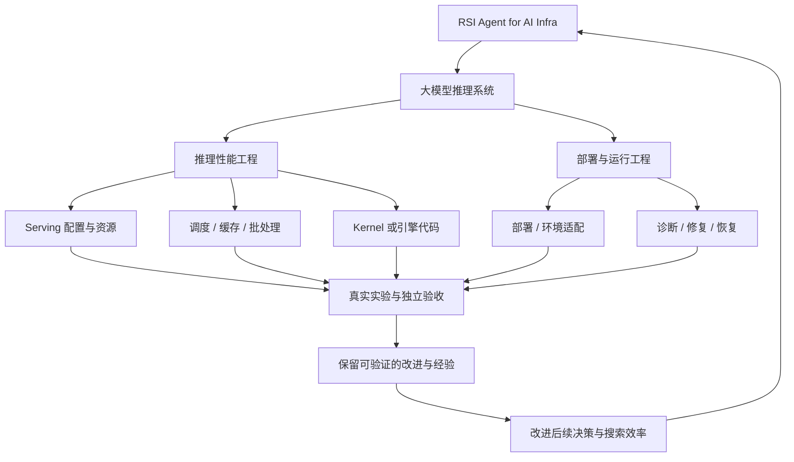
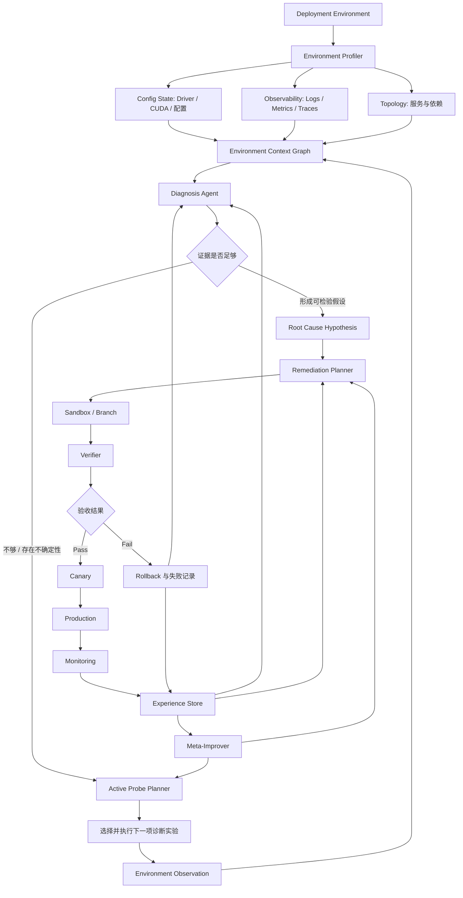
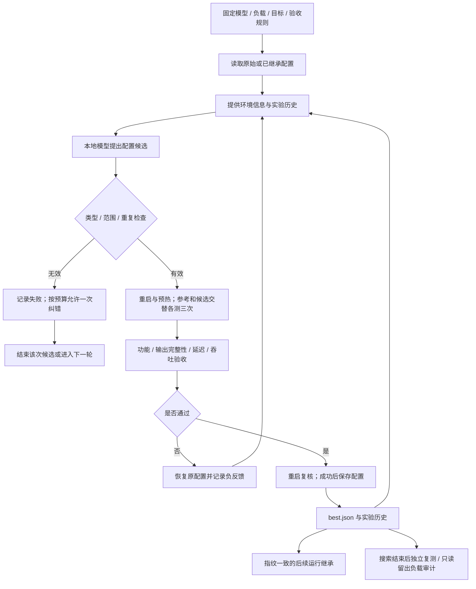
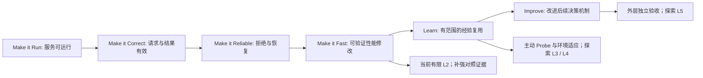

# RSI for AI Infra：研究总方向、Demo 进度与下一步路线

更新日期：2026-09-30。实验数据截至 2026-09-24；本文整理已有记录，没有新增实验。项目目录：`D:\Projects\ai-deployment-doctor`。

**当前定位：面向大模型推理系统的 training-free、可验证、有限动作空间 L2 Demo。** 本地模型已经自主提出配置修改，经真实 GPU 推理测量验收后保留，并在后续运行中继承；不合格修改能够拒绝和恢复。尚未证明 Agent 优于随机搜索或固定规则，也尚未实现完整的环境诊断与部署故障修复系统。

本文把导师提出的总方向、对话中的系统愿景和当前实现放在同一条路线里。文献链接指向论文原文或作者项目；推荐依据主要是问题相关性与方法设计，不代表已经逐篇精读或复现，也不是完整的系统性文献综述。

## 1. 大的总方向：RSI Agent for AI Infra

导师原始要求是：**关于 RSI 的 AI Infra Demo，主要在大模型推理系统场景下实现。** 研究对象是模型、推理引擎、配置、工作负载和运行环境共同组成的系统。

可以从两个相互连接的切口进入：

| 切口 | Agent 改进什么 | 可验证的结果 | 当前关系 |
| --- | --- | --- | --- |
| 推理性能工程 | 批处理、并发、缓存、调度、资源配置，后续可扩展至代码或 kernel | 在固定质量与延迟约束下提高吞吐或 goodput、降低资源成本 | 当前 Demo 的直接切口 |
| 部署与运行工程 | 环境适配、故障诊断、诊断实验选择、修复与恢复 | 服务恢复、请求正确、SLO 达标、修复可复现 | 对话中提出的长期系统愿景 |

“Self-Improving Forward-Deployed Engineer for AI Systems”和“Environment-Aware Self-Improving Deployment Agent”是部署工程切口的候选命名。它们与总方向有联系，但如果只做一般配置文件修复、脱离大模型推理负载与系统指标，就会弱化导师要求的 AI Infra 场景。

当前先做推理配置优化，是因为本机已有可测量的真实推理服务，验收条件可冻结，实验成本可控。之后可以把“服务启动失败、资源不足、请求失败、性能退化”纳入同一个推理系统实验框架。

### 1.1 总研究问题与当前可检验问题

总问题：

> Can an AI agent autonomously diagnose, remediate, verify, and learn from AI deployment failures across heterogeneous production environments?

对应中文：AI 模型或 Agent 部署到陌生环境后，能否理解环境、发现不兼容或性能问题、收集诊断信息、生成修复方案、验证修改、持久化经验，并逐渐改善后续部署和故障处理能力？

当前可检验的问题应更窄：

> 在模型权重、任务目标、动作空间与验收器固定的条件下，Agent 能否根据环境信息和真实实验反馈，选择有效的推理配置修改，并在相同总预算下比随机搜索与固定规则更快找到可验收改进？

第一部分“能否提出并保留有效修改”已有单机证据；第二部分“是否比基线更有效”尚未成立。未来的研究贡献必须来自环境与反馈如何改变决策，而不能只来自发现一个普遍有效的配置。

### 1.2 Training-free 与 RSI 的关系

当前不更新模型权重，不做 SFT 或 RL；改变的是推理系统配置与保存的运行状态。因此它是 training-free，但仍消耗模型推理和系统实验算力。

应区分四件事：模型执行了一次修改、系统性能提高、Agent 后续决策能力提高、Agent 改进了自己的改进机制。它们需要不同证据。配置收益不能直接证明模型变聪明；保存一次配置也不能直接证明递归自我改进。

## 2. L1–L5：采用的定义与当前能力

等级依据是 [The Last AI Built by Humans 的 v2 §3.3](https://arxiv.org/html/2609.11873v2#S3.SS3)。为保持与之前讨论一致，这里固定引用 v2；下面的推理系统例子是本项目对等级的应用，不是论文原文定义的逐字翻译。

| 等级 | 自主性所在层面 | 在部署 / 推理系统中的对应例子 | 本项目状态 |
| --- | --- | --- | --- |
| L1 | 执行改进动作 | 按固定 runbook 修改配置并启动验证 | 已有执行与验收基础设施 |
| L2 | 决定改进策略；目标、任务边界和评估外部固定 | 根据证据选择修复或性能配置实验 | 已有有限配置空间的自主提案成功案例；没有完整故障诊断能力 |
| L3 | 获取经验或学习信号的策略 | 自主选择下一项日志、压测或诊断 probe | 未实现；目前实验与测量流程固定 |
| L4 | 环境适应层面的改进 | 根据环境变化更新和复用适配经验 | 未验证；目前仅允许严格指纹匹配的配置继承 |
| L5 | 递归改进机制与继承 | 改进诊断 / 搜索 / 修复策略，并使后续周期更有效 | 未实现；规划器 v2 是人工修改 |

**可以说“已跑通有限动作空间的 L2 闭环”，不能说“已实现开放式 RSI”。** L2 描述谁决定怎么改进，并不保证决策优于随机搜索。这里的“本地 Agent”仍是一个预训练模型加固定控制程序，不能把控制程序的人工升级算成 Agent 自我进化。

## 3. 完整愿景架构：Environment-Aware Deployment Agent

下图保留对话中的完整流程。它是目标架构，不代表模块均已实现。

各模块需要承担的责任：

- **Profiler / Context Graph：**收集环境事实、版本、资源、服务依赖和观测证据；区分实际观察与推测。
- **Diagnosis / Probe Planner：**提出可证伪的根因假设，在不确定时选择有信息价值的诊断动作。
- **Remediation Planner：**选择有边界的修改，给出预期效果、适用条件与恢复路径。
- **Verifier：**独立检查服务、功能、性能和约束；不能以 Agent 自称“修好了”作为成功标准。
- **Experience Store：**保存成功与失败证据，以及可复用的范围。
- **Meta-Improver：**提出策略机制变更，并通过外部冻结的评估判断是否值得继承。

当前 Demo 中已有规划器、受限配置执行、验证、恢复、记录与严格配置继承；没有 Context Graph、主动 probe、生产 canary 或自主 Meta-Improver。现有服务重启和单独运行目录也不等于安全沙箱隔离。

### 3.1 Scope-aware Memory：下一阶段的候选核心

经验不能只有“配置 A 曾经成功”。至少应包括：环境指纹、负载特征、症状、假设、干预、验证证据、适用条件、失效条件和失败记录。

建议从结构化表开始，而不是先搭复杂向量数据库：

| 字段 | 示例 / 用途 |
| --- | --- |
| environment | 模型与量化、引擎版本、设备、显存 / 内存 |
| workload | 输入输出长度、并发、请求速率、prompt 分布 |
| symptom / hypothesis | 吞吐低；怀疑批处理不足，并标注不确定性 |
| intervention | 修改哪些参数、原值与新值 |
| evidence | 配对测量、功能检查、原始记录与验收器版本 |
| scope | 哪些条件支持复用，哪些条件尚未验证 |
| negative evidence | 低并发下无收益、输出无效、失败或恢复结果 |

继承路径可以从“严格一致 → 有证据的兼容条件 → 重新验证 → 接受或拒绝”逐步扩展。当前 `best.json` 的严格指纹检查只是起点，尚不能称为跨环境的 Scope-aware Memory。

## 4. 当前实际实现的 Demo

### 4.1 技术选择与运行条件

| 项目 | 已实现 / 已核实状态 |
| --- | --- |
| 本机环境 | Windows 原生运行；RTX 3070 Ti Laptop GPU，8GB 显存 |
| 推理引擎 | 官方 llama.cpp b11138，Vulkan GPU 后端 |
| 模型 | Qwen2.5-1.5B-Instruct-GGUF，Q4_K_M；固定模型版本与 SHA-256 |
| 提案模型 | 同一个本地 1.5B 模型；不依赖实验室 API Key |
| Agent 工程 | 自建轻量 Python 控制器；复用成熟推理引擎 |
| 动作空间 | `parallel ∈ {1,2,4,8}`；`ubatch_size ∈ {64,128,256,512}`，共 16 种组合 |
| 原始配置 | `(parallel=2, ubatch_size=128)` |
| 选择器 | local、random、fixed；OpenRouter 接口已保留，实际调用未验证 |
| 状态与报告 | 独立运行目录、原始记录、HTML 报告、`best.json`、版本 / 指纹 |
| Linux vLLM | 适配器已按 v0.30.0 源码检查；尚未真实运行验证 |

当前采用“复用成熟引擎，自建最小实验闭环”。这比直接移植完整 Kubernetes Agent 更适合第一版：硬件与验收结果已经可控制，Agent 的决定也容易定位。正式部署故障阶段可借鉴第 6 节的开源项目，但没有依据称其可直接套用到现有 Windows GPU 实验。

### 4.2 实际运行闭环

验收器由人固定：完整请求与输出、延迟约束、三个固定 prompt 的功能一致性检查；参考和候选交替测量各三次；吞吐中位数提升至少 5%，且候选最小值高于参考最大值，才允许进入保留流程。保留还要重启复核，失败则恢复。

这些是保守的工程门槛。5% 与测量区间不重叠不等于统计显著性，三个 prompt 也不等于完整语义质量评测。当前首轮短负载适合工程演示，不足以代表持续生产流量。

### 4.3 真实实验结果

| 实验 | 已观察结果 | 能支持什么 / 不能支持什么 |
| --- | --- | --- |
| 首轮本地 Agent | 自主选择 `(4,512)`；吞吐中位数约 247 → 321 输出 token/s，约 +29.9%；验收通过 | 支持自主配置提案能产生真实系统收益；不支持普遍最优 |
| 后续继承 | 新运行继承相同配置，复测约 321 输出 token/s | 支持经过校验的配置状态可以继承；不是策略能力进化 |
| 下一轮失败 | 本地 Agent 提出的候选约下降 24.4%，被拒绝并恢复 | 支持拒绝与恢复闭环，且说明提案质量不稳定 |
| 两组留出负载 | 冻结配置、只读审计，分别约 +22.8%、+19.3% | 支持部分负载形状变化下仍有收益；未验证跨模型 / 机器 |
| 三次 Agent 与三次随机 | Agent 接受 3/3，随机接受 1/3 | 小规模探索性比较；不足以证明优于随机 |
| 两任务环境试点 | 低并发均无验收提升；高并发 Agent +24.4%，随机 +9.8%，固定规则 +24.9% | 固定规则可解释当前收益，未证明环境感知带来额外效果 |
| 规划器 v2 | 阻止重复配置执行并允许一次纠错；低并发仍未找到有效提升 | 修复了一个工程问题；尚未证明策略改进，更不属于自主 L5 |

上表汇总的是不同协议的实验，数值不能直接合并成一个平均收益。尤其高并发 Agent 与固定规则都选择 `(4,512)`，独立复测的 24.4% 与 24.9% 差异应视为测量波动，不能解释成方法差异。

环境试点计划包含更多随机种子，但实际只完成种子 100；固定规则使用一个候选，Agent / 随机最多两个候选。因此不能把它写成已完成的严格等总成本比较。v1 的重复提案与无效提案也必须保留在结果中，不能用 v2 结果覆盖。

项目记录包含 27 项单元测试通过，覆盖关键校验与恢复等逻辑；本文没有重新运行测试。测试通过不能替代真实推理实验。

### 4.4 证据与文件入口

- [README 与运行入口](../README.md)
- [机器可读状态](../project_status.json)
- [安装与 API 配置说明](SETUP.md)
- [真实推理实验、继承与拒绝](RESULTS_2026-09-24.md)
- [两组只读留出负载审计](HOLDOUT_2026-09-24.md)
- [三次 Agent / 三次随机探索性比较](COMPARISON_2026-09-24.md)
- [环境试点协议](PILOT_PROTOCOL_2026-09-24.md)
- [环境试点结果与失败分析](PILOT_RESULTS_2026-09-24.md)
- [规划器 v2 修改及复测](PLANNER_V2_2026-09-24.md)

## 5. 如何研究“优于随机搜索”

有限实验不能证明 Agent 在所有环境、所有预算上普遍优于随机搜索。可争取的结论是：**在事先定义、独立留出的任务分布上，在相同总预算下，某方法平均表现更好，并报告不确定性与失效范围。**

当前空间只有 16 种配置，随机和固定规则都是强基线。必须证明 Agent 利用了额外证据，而不是反复提出同一个常见好配置。

建议冻结以下协议，再开展下一组实验：

1. **定义任务。**组合并发、输入输出长度、到达模式与服务约束；先用本机建立机制实验，之后加入不同模型与 Linux GPU。已经用于调试的任务放入开发集，最终比较使用新任务。
2. **固定可比条件。**相同起点、合法动作空间、测量器、验收器与候选预算。另记模型调用、token、纠错、重复 / 无效提案、实验耗时；它们都是方法成本。
3. **设置有辨识力的对照。**随机无放回搜索、固定规则、无环境信息 Agent、无历史 Agent、完整 Agent。小空间可穷举作为性能上限参考，其成本不应混入同预算基线。
4. **冻结后独立评分。**搜索选择结束后重启复测最终配置；不能直接报告被选中的搜索阶段最高值。没有接受候选时保留原配置并计入结果。
5. **控制测量噪声。**记录设备负载与温度，方法顺序随机化或分块；同一 GPU 上的系统测量顺序执行，避免相互抢占资源。
6. **按任务分析。**报告最终收益、达到目标所需预算、成功率、无效 / 重复提案率及成本。采用任务配对差值和合适的置信区间；不能把同一任务的三次测量当成三个独立任务。

可先用 12–20 个任务、预算 1 / 2 / 4 和多个随机种子做探索性设计，再据方差与效果大小确定正式样本量。这个数量只是启动建议，不保证统计功效。统计比较可参考 [Demšar 2006](https://jmlr.org/papers/v7/demsar06a.html)，并根据任务相关性与重复实验结构调整方法。

最有价值的失败结果也应报告：某些低并发任务可能本来就无可用改进；一个能正确停止、避免浪费预算的 Agent，未必需要在每个任务上提高吞吐。

## 6. 文献地图与本周优先阅读

### 6.1 本周先读 5 篇

| 顺序 | 论文 | 为什么先读 | 阅读后应产出的东西 |
| --- | --- | --- | --- |
| 1 | [The Last AI Built by Humans](https://arxiv.org/abs/2609.11873)，2026 预印本；先读 v2 §3.3 | 确定 L2 与 RSI 的声明边界，区分自主性、收益与递归机制改进 | 一页“我们已证明 / 未证明”与等级映射 |
| 2 | [Reflexion](https://arxiv.org/abs/2303.11366)，2023 | 理解不改权重、以语言反馈和经验记忆影响后续决策的路径 | 成功 / 失败经验结构，以及无历史消融设计 |
| 3 | [Sarathi-Serve](https://www.usenix.org/conference/osdi24/presentation/agrawal)，OSDI 2024 | 理解 prefill / decode、批处理与吞吐—延迟权衡，避免只凭直觉调参数 | 两三个可检验的性能瓶颈假设和必要指标 |
| 4 | [ARBITER](https://arxiv.org/abs/2607.19182)，2026 预印本 | 有边界的动作、控制与验收设计贴近部署修复闭环 | typed action、修改前置条件与恢复流程草案 |
| 5 | [Random Search for Hyper-Parameter Optimization](https://www.jmlr.org/papers/v13/bergstra12a.html)，JMLR 2012 | 把随机搜索当作需要认真击败的基线 | 冻结的动作空间、总预算和独立评分协议 |

如果推理系统基础较薄，先补读 vLLM，再读 Sarathi-Serve。若下一阶段选择记忆方向，随后读 A-MEM；若选择故障修复方向，随后读 OperAID 的论文信息与作者代码。以上清单按当前决策价值排序，不是按论文声望或发表时间排序。

### 6.2 RSI 与 training-free Agent 反馈学习

| 文献 | 对课题的价值 | 使用边界 |
| --- | --- | --- |
| [The Last AI Built by Humans: Toward Genuine Recursive Self-Improvement](https://arxiv.org/abs/2609.11873)，2026 | RSI 等级、继承与评估问题；当前使用 [v2 §3.3](https://arxiv.org/html/2609.11873v2#S3.SS3) | 作为概念框架，不能替我们证明实验有效 |
| [ReAct: Synergizing Reasoning and Acting in Language Models](https://arxiv.org/abs/2210.03629)，2022 预印本 / ICLR 2023 | 推理、工具动作与观测交替；主动诊断的基础设计 | 一般工具 Agent 机制不等于环境自适应 |
| [Reflexion: Language Agents with Verbal Reinforcement Learning](https://arxiv.org/abs/2303.11366)，2023 | 语言反馈和 episodic memory，不依赖权重更新 | 记忆有用性需要任务上的因果消融 |
| [Self-Refine: Iterative Refinement with Self-Feedback](https://arxiv.org/abs/2303.17651)，2023 | 不训练的生成—反馈—修改循环 | 推理系统仍必须依赖独立真实测量，不能只让 LLM 自评 |
| [Darwin Gödel Machine: Open-Ended Evolution of Self-Improving Agents](https://arxiv.org/abs/2505.22954)，2025 预印本 | 自主修改 Agent 代码与经验性评估的长期参考 | 当前配置优化距离此类机制修改仍很远 |
| [A-MEM: Agentic Memory for LLM Agents](https://arxiv.org/abs/2502.12110)，2025 | 记忆组织与关联的参考 | 不能直接证明部署经验的适用范围或跨环境安全复用 |

### 6.3 大模型推理系统

| 文献 | 核心问题 | 在本项目中的位置 |
| --- | --- | --- |
| [Orca: A Distributed Serving System for Transformer-Based Generative Models](https://www.usenix.org/conference/osdi22/presentation/yu)，OSDI 2022 | 迭代级调度与批处理 | 理解 serving 调度为何影响性能 |
| [Efficient Memory Management for Large Language Model Serving with PagedAttention](https://arxiv.org/abs/2309.06180)，2023，vLLM | KV cache 管理与服务吞吐 | Linux GPU / vLLM 扩展的系统背景 |
| [Taming Throughput-Latency Tradeoff in LLM Inference with Sarathi-Serve](https://www.usenix.org/conference/osdi24/presentation/agrawal)，OSDI 2024 | prefill、decode 与吞吐—延迟权衡 | 环境 / 负载特征到配置选择的机制假设 |
| [SGLang: Efficient Execution of Structured Language Model Programs](https://arxiv.org/abs/2312.07104)，2023 起的预印本 | 结构化 LLM 程序、缓存与运行时优化 | 后续增加另一类引擎与负载的参考 |

这些论文帮助解释系统瓶颈；不能把论文中其他硬件与工作负载的性能数字直接迁移到当前 llama.cpp Laptop 实验。

### 6.4 部署诊断、环境上下文与修复

2026 年条目包含较新的预印本与作者项目，应在精读时继续核查完整方法、评测协议和代码状态。

| 文献 / 作者项目 | 与完整架构的关联 | 建议使用方式 |
| --- | --- | --- |
| [ARBITER: Guarded Agentic Control for SLO-Oriented Kubernetes Remediation](https://arxiv.org/abs/2607.19182)，2026；[作者代码](https://github.com/pooyan/arbiter) | 受限动作、控制约束、SLO 修复 | 重点借鉴动作和验收边界，再评估是否移植 |
| [OperAID 作者论文与开源项目](https://github.com/EricssonResearch/operaid)，2026 | Kubernetes 故障修复任务与验证 | 可参考故障注入与评测组织；这里的发表信息以作者仓库为依据 |
| [ARGUS: MCP-Grounded Root Cause Analysis for Kubernetes Incidents](https://arxiv.org/abs/2608.23084)，2026 预印本 | 工具支持的根因诊断与观测证据 | 借鉴诊断证据组织；区分诊断正确与修复有效 |
| [KuTIE: Does Runtime Topology Context Improve LLM-Generated Kubernetes Security Patches?](https://arxiv.org/abs/2607.25995)，2026 预印本；[作者 artifacts](https://github.com/dynatrace-research/kutie-artifacts) | 运行时拓扑上下文对补丁生成的作用 | 为 Context Graph 的必要性提供设计参考；其安全补丁场景不等同推理优化 |

### 6.5 经典基础与评测方法

| 文献 | 对课题的作用 |
| --- | --- |
| [The Vision of Autonomic Computing](https://doi.org/10.1109/MC.2003.1160055)，Kephart & Chess，2003 | 自主管理系统的历史基础，帮助辨别新的 Agent 方法与既有自动化 |
| [Dapper, a Large-Scale Distributed Systems Tracing Infrastructure](https://research.google/pubs/dapper-a-large-scale-distributed-systems-tracing-infrastructure/)，2010 | 分布式观测与 tracing 的经典背景 |
| [Random Search for Hyper-Parameter Optimization](https://www.jmlr.org/papers/v13/bergstra12a.html)，Bergstra & Bengio，2012 | 合理随机基线、预算与搜索空间设计 |
| [Statistical Comparisons of Classifiers over Multiple Data Sets](https://jmlr.org/papers/v7/demsar06a.html)，Demšar，2006 | 多任务配对比较与统计检验；需检查具体适用假设 |
| [Deep Reinforcement Learning That Matters](https://ojs.aaai.org/index.php/AAAI/article/view/11694)，Henderson 等，2018 | 随机性、方差与可复现评估；借鉴方法，不把 RL 结论直接套到配置搜索 |

## 7. 下一步的可能方向与优先级

### A. 先做可信的环境感知 L2 比较——最高优先级

问题：当前 1.5B 模型有重复与格式失败，且有效配置可由固定规则给出。先解决方法是否值得继续研究。

建议实现：把合法未试配置显式列给模型，用候选 ID 选择；保留选择理由与预期效果；拒绝无效输出并计入成本，不静默替换为随机候选。给环境 / 负载信息与失败反馈做消融，冻结规划器版本，然后在新任务上比较。

产出：一套可复现协议、完整成本表、独立最终评分、方法差值与失效范围。若完整 Agent 没有优势，应诚实报告，并依据错误分析决定更换规划器、丰富证据或转向记忆问题。

### B. Scope-aware Memory——最建议的研究候选

问题：某次成功的经验何时可以复用？如何避免在不同并发、模型或设备上盲目迁移？

当前已有一个有用现象：同一常见配置在高并发有收益，在低并发没有可验收收益。这提供了研究环境条件的切口，但尚不能证明记忆方法有效。

建议对照：无记忆、无条件复用、严格指纹记忆、带适用范围并重新验证的记忆。开发环境构建经验，留出环境测复用效果。核心指标是冷启动实验成本、最终收益、负迁移率和必要的重新验证成本。先用结构化记录与规则实现可解释基线，再考虑 LLM 生成适用条件。

这条路线连接当前性能 Demo 与长期 Deployment Agent，工作量比完整 Kubernetes 诊断系统更可控；是否有研究新意仍需更深入文献审查与实验。

### C. 推理服务故障诊断与主动 Probe——随后扩展

在独立实验服务上构造可复现故障，例如模型路径错误、端口占用、请求参数不兼容；资源不足场景需要真实资源限制和明确根因标签。首轮先用固定诊断工具与受限修复动作，再比较自主 probe 与固定 runbook。

核心指标：根因正确率、服务恢复率、恢复时间、诊断 / 修改成本、误修复和恢复失败。验证应由故障注入记录、功能请求和独立测试构成；不能以 LLM 自评作为标签。

该方向更贴近最初“部署修复闭环”的愿景。只有 Agent 确实自主选择有价值的诊断实验，才有进一步讨论 L3 的依据。

### D. L5 Meta-Improver——长期方向

允许 Agent 提出规划器提示词、检索规则、probe 选择策略或代码的候选版本；外层评估器与目标冻结，比较变更后在留出任务和同总预算下是否改善后续改进能力，再决定继承。

外层预算必须计入生成、筛选和验证策略的费用。Agent 修改评分标准让自己更容易通过，不属于可信收益。当前没有这类实验，短期不宜以 L5 作为完成声明。

这是一条工程路线，不表示只要存了记忆就自动升到 L4，或只要修改了提示词就自动升到 L5。

## 8. 近期执行路线与资源安排

| 阶段 | 主要工作 | 完成判断 |
| --- | --- | --- |
| 第一步：冻结协议 | 候选 ID、错误成本、版本、新任务与对照设计 | 每一种方法的预算和最终评分可核对 |
| 第二步：本机机制实验 | 环境 / 历史消融、随机多种子、固定规则、独立复测 | 能判断现有证据是否改变配置决策 |
| 第三步：记忆原型 | 结构化成功 / 失败经验、适用条件、复用后重验证 | 在留出任务上量化省下的成本与负迁移 |
| 第四步：Linux GPU 验证 | 真正运行 vLLM，加入另一模型 / 硬件条件 | 新后端的安装、测量、恢复与结果得到实测 |
| 第五步：故障与 probe | 推理服务故障注入、根因标签、受限修复 | 可以独立评估诊断和修复，随后评估 probe 决策 |

本机足够继续第一至第三步的原型与单机机制实验。普通 Linux CPU 服务器可运行控制器、小型服务与部分故障测试，但不能替代 GPU 推理性能实验。后续引入 vLLM 或跨硬件性能比较时，再租具备所需权限与 GPU 的 Linux 环境，并先确认运行约束。

OpenRouter 是可选的远程规划模型渠道；实验室 Key 暂时不可用，当前本地路线不依赖它。拿到 Key 后可以用更强规划模型做额外对照，但必须仍由本地冻结验收器判断结果，并把远程调用成本纳入预算。没有必要为了等待 API 阻塞当前实验。

**当前最推荐的路线：先把环境感知 L2 的对照做可信，再做带适用范围的经验复用；随后扩展到真实推理服务故障和主动诊断。** 这样保留导师的 RSI / AI Infra / 大模型推理系统主线，同时每一阶段都有独立、可验证的研究问题。
